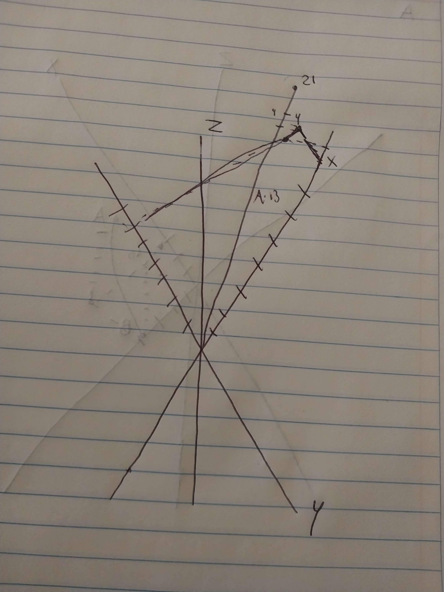

Nombre completo: Joseph Serratos Quirarte
Código de la materia: IPV 6196
Nombre de la carrera: Ingeniería en Programación de Videojuegos
Fecha de elaboración: 27/09/2023

### Primera parte
Dados los vectores:
**A. (2,4,6)**
**B. (3,1,-6)**
**C. (-2,5,0)**

1. **Encuentra las constantes α y β tales que C = αA + βB**

   (-2, 5, 0) = α(2, 4, 6) + β(3, 1, -6)

**x)** -2 = 2α + 3β
-2 = 2 + 3β
-4 = 3β
-4
/3 = β

**y)** 5 = 4α + β
5 = 4α + α
5 = 5α
1 = α

**z)** 0 = 6α - 6β
6β = 6α
β = α

0 = 6α - 6β
0 = 6 + β(
-4
/3
)
0 = 6 -
-4/
3β
0 =
18
/3 +
4
/3β
0 =
22
/3β
-
22
/3 = β

***No existen***

**2. Ecuentre**

a. ||A||
||A|| = sqrt(2^2 + 4^
2 + 6^
2
) = **7.4833**

b. ||A+C||
A + C = (2 - 2), (4 + 5), (6 + 0)
||A + C|| = sqrt(0^
2 + 9^
2 + 6^
2
) = **10.8166**

**3. Tomando del origen al vector A, y al vector B, determine la magnitud y
los componentes del vector resultante de unir los extremos de A y B.
Grafica tus vectores.**

A = (2, 4, 6)

B = (3, 1, -6)

AB = ((Bx - Ax,), (By - Ay), (Bz - Az))

AB = ((3 - 2), (1 - 4), (-6 - 6))

AB = (1, -3, -12)

||AB|| = sqrt(1^2 *
 3^
2 *
 12^
2
) = **12.4096**

### Segunda parte

Dados los vectores:

A. (5,-4,7)

B. (7,1,3)

C. (1,8,-5)

D. (3, -6,0)

Calcule los siguientes productos punto
1 y producto cruz
2 y grafique el vector resultante

**4. A * B** =

A*B = (5, -4, 7) * (7, 1, 3)

A*B = (5 * 7) + (-4 * 1) + (7 * 3)

A*B = 35 - 4 + 21 = 52

||A|| = sqrt(5^
2
4^
2 + 7^
2
) = **9.4868**

||B|| = sqrt(7^
2 + 1^
2 + 3^
2) = **7.6811**

cosθ =
52
/(9.4868)(7.6811) = **0.7136**

θ = cos^
-1
(0.7136) = **0.7761**

**5. B*D**

B*D = (7, 1, 3) * (3, -6, 0)

B*D = (7 * 3) + (1 * -6) + (3 * 0)

B*D = 21 - 6 = 15

||B|| = sqrt(7^
2 + 1^
2 + 3^
2
) = **7.6811**

||D|| = sqrt(3^
2 -
6^ 
2 + 0^
2
) = **6.7082**

cosθ =
15
/(7.6811)(6.7082) = **0.2911**

θ = cos^
-1
(0.2911) = **1.2754**

### Caso 2 Perpendicular

**6. AxD**
A x D = (5, -4, 7) x (3, -6, 0)

(-4 * 0) - (7 * -6) = **42 → x**

(7 * 3) - (5 * 0) = **21 → y**

(5 * -6) - (-4 * 3) = **-18 → z**

**7. CxB**

C x B = (1, 8, -5) x (7, 1, 3)

(8 * 3) - (-5 * 1) = **29 → x**

(-5 * 7) - (1 * 3) = **-38 → y**

(1 * 1) - (8 * 7) = **-55 → z**

